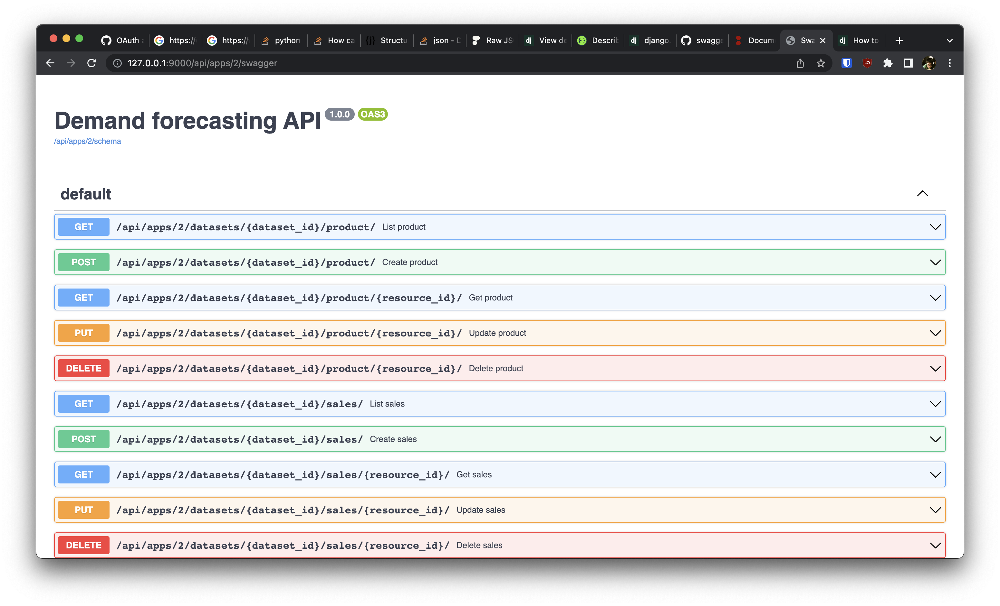

# Data anagement API Generator (DAG)

This service takes in a schemas definition from an app and generate the management APIs on the fly to manage
data sets for this app.

Notice the APIs and data models are generated dynamically, we do not pre-code any data models or views.

## Usage

Start the server

```sh
python manage.py migrate
python manage.py runserver 9000
```

To populate some data
```sh
# create an app. The app will declare the data format it takes
http POST :9000/api/apps/ < resources/forecast_app.json

# create a dataset
http POST :9000/api/apps/1/datasets/ name='a new dataset' description='some description'

# create a product resource
http POST :9000/api/apps/1/datasets/1/product/ < resources/forecast/product.json

# create a sales resource
http POST :9000/api/apps/1/datasets/1/sales/ < resources/forecast/sales.json

# create some more resources if you wish
...

# view all products under the dataset
http :9000/api/apps/1/datasets/1/product/
```

or load some predefined data

```sh
python manage.py loaddata resources/fixture.json --format json
```

To export the data (either download it, or return a json representation so it can be rendered by other editor)

```sh
# dump the dataset in json format (used to render in whatever editor)
http :9000/api/apps/1/datasets/1/dump?type=json

# dump the dataset in excel format and download it to local
http :9000/api/apps/1/datasets/1/dump?type=excel
```

To see all supported APIs for an app, see `localhost:9000/api/apps/1/swagger`


